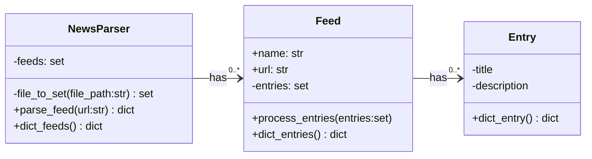
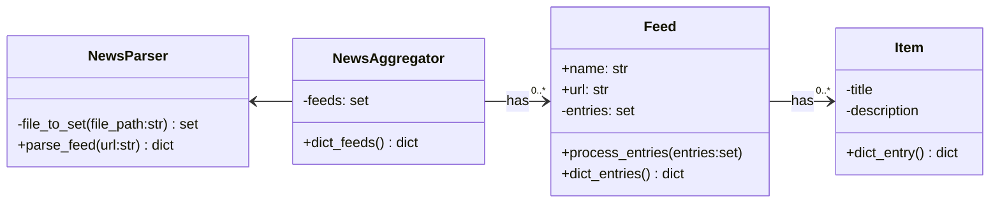
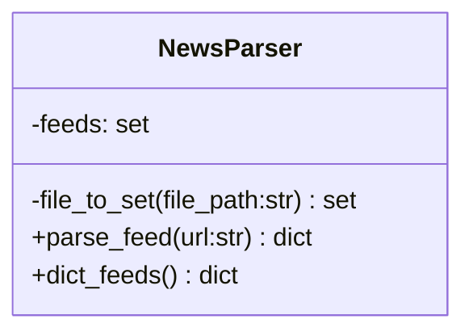
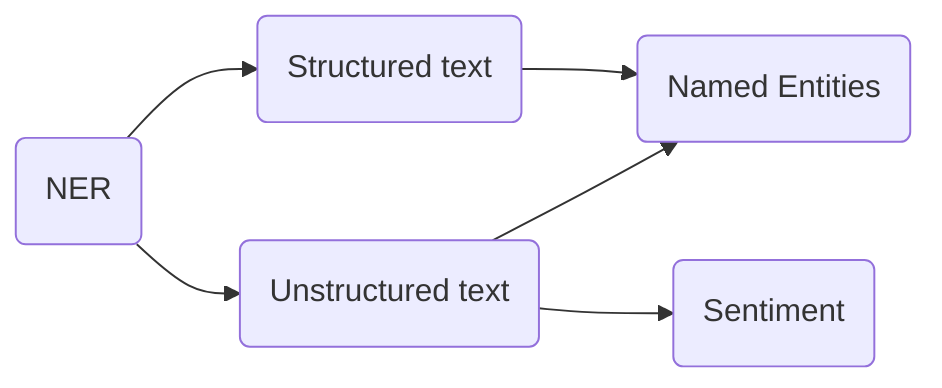

# Development Log

## 01-02-2023

Started working on news aggregator module with the **feedparser** module to aggregate news articles and put them through a sort of sorting algorithm.

> Sorting algorithm calculates weight per feed, after that looks for word occurences and tries to find all *named entities* and sort them to occurance. 

Found out however that the feedparser module does not seem to work with all rss feeds I want to use, therefore planning to use **XML** module instead and write a feedparser of my own. 

Besides that I realised that recognising *named entities* by using **RegEx** and building an algorithm of my own is way too complex to be able to get quality results that I will be start testing with **NLTK** instead.

Also using stopwords by **NLTK** instead of writing them by myself


## 06-02-2023

Starting with high level concept and idea, written in [README.md](/README.md)
Unclear what goal should be, after chat with ChatGPT clearer image. 

Website with geared towards end users being researchers & journalists that aggregates and sorts tweets according to current news events.

> Current news events being provided by a number or well established news sources, both international and regional

>Run script whenever one of the news sources has tweeted a tweet that contains a link to their website? 
Making sure the rss aggregate script does not have to run needlessly
**idea provided by Timothy**

Just read about NLTK VADER, which might be nice to use for twitter content


## 09-02-23

To handle the news parsing module of the application I am thinking of creating a NewsParser class that handles all parsing and returning of parsed news feeds for use in NER. 

In case I'd want to use the newsfeeds in other instances however storing them in objects would also not be a bad idea. 

New dilemma: Does the newsparser call the NER or the other way around. What will the NewsParser be used for: **Only to be run through
 NER**

The only things the Entry() class needs is therefore a title and description/summary as the rest of the information will not be used. 
Possibility to merge title and description but keeping them seperate may yield interesting information in the future.


> Maybe parsing of certain feeds on certain signs is better than to parse them all together changing the classes to be NewsAggregate and spliting the parsing portion as NewsParser




> **Side note for future reference**
> Havent thought about accessibility, might be handy for the front en dpart, maybe too much though...

## 11-02-2023
Started working on NewsParser() and tests, not resally sure whether creating own xml parser is best course of action but we will find out. In a sense it is a very simple parser that only needs to acess certain information, therefore handling it should not be too complex. 
Besides that: Creating a class for the parsing part might be too overkill and a functional programming approach would work better instead of OO.


NewsAggregator() and NewsParser() can once again be combined into one single class which then creates instances of Feed() and Item()



## 12-02-23

Thinking I have maybe already overengineered something, namely the NewsAggregator() module that also contains a Feed class and Item class that I will likely not use and makes everything a bit more complex as it converts a dict into objects but for use by NER it converts these objects back into dicts....
Below what I had, stripping away the Feed and Item class
<details>
<summary>Code snippet with redundant classes</summary>

```
import requests, re, validators
import xml.etree.ElementTree as ET

ERROR_PARSING = 'The parser was unable to succesfully parse the feed or the feed was incomplete'

class Item():
    
    def __init__(self, title, summary):
        self.__title = title
        self.__summary = summary
    
    
    def to_dict(self):
        return {self.__title:self.__summary}
        


class Feed():
    
    def __init__(self, title, language):
        self.__title = title
        self.__language = language
        self.__items = []
    
    
    def add_item(self, item):
        
        self.__items.append(Item(item['title'], item['summary']))
        
    
    def to_dict(self):
        
        feed_dict = dict()
        feed_dict['title'] = self.__title
        feed_dict['language'] = self.__language
        feed_dict['items'] = [item.to_dict() for item in self.__items]
        
        return feed_dict


class NewsAggregator():
    
    def __init__(self):
        self._feeds = set()
    
    def _file_to_set(self, file_path:str):
        """
        Reads file from file_path and returns each line as an element of a set.
        Ignores comments '#' and empty lines

        Args:
            file_path (str): The file to be read

        Returns:
            set: A set with all lines of the read file
        """
        if not isinstance(file_path, str):
            raise TypeError
        
        set_of_file = set()
        
        with open(file_path, 'r') as f:
            lines = f.readlines()
            for line in lines:
                stripped_line = line.strip()
                if stripped_line == '':
                    continue
                elif stripped_line[0] == '#':
                    continue
                set_of_file.add(stripped_line)
        return set_of_file
    
    
    def _parse_feed(self, rss_url:str):
        """
        Parses a rss xml feed. Raises errors whenever the link provided is no .xml file or when the dictionary returned contains an empty title or items. Retrieves feed name, language and title and description from all items. Returns them in a neat dictionary
        
        Will only parse .xml file in rss feed structure as demonstrated here:
        https://www.w3schools.com/XML/xml_rss.asp

        Args:
            rss_url (str): Url or path proided from which to parse an XML document

        Returns:
            dict: Dictionary containing information regarding the feed and its items
        """
        
        xml_feed = rss_url
        if validators.url(rss_url) is True:
            if '.xml' not in rss_url:
                raise Exception('The url provided is not an .xml file')
            
            xml_feed = requests.get(rss_url).content

        tree = ET.parse(xml_feed)
        root = tree.getroot()
        
        feed_dict = dict()
        feed_dict['title'] = root.find('channel/title').text
        feed_dict['lang'] = root.find('channel/language').text
        feed_dict['items'] = []        
        items = root.findall('channel/item')
        
        for item in items:
            title = item.find('title').text.strip()
            summary = "".join(item.find('description').itertext()).strip()
            item_dict = {'title': title, 
                         'summary': summary
                         }
            feed_dict['items'].append(item_dict)
        
        if feed_dict['title'] is None or feed_dict['items'] == []:
            raise Exception(ERROR_PARSING)
        
        return feed_dict
        
       
    def aggregate(self, file_path:str):
        
        if isinstance(file_path, str) is False:
            raise TypeError()

        
        
```

</details>

Now starting with NER module as this will be called by the NewsAggregator() module to run through all feeds.

Still not sure whether I should assig any weights to NE yet.


## 13-02-23

Started reading up more about NLTK. It would do good when creating the NER to make two variants, one being for well organized and gramatically correct text and the other being for tweets for example as the pretrained models are mostly trained on properly written english.

As an alteration of the end product maybe it would do good to show the most talked about topics, (with links to news articles?) with corresponding tweets organized by sentiment (being positive or negative). If training the model is doable ofcourse, however VADER seems to be doing this exact trick, therefore not sure whether to try myself. 
Links for reference:
https://www.guru99.com/pos-tagging-chunking-nltk.html
https://towardsdatascience.com/intro-to-nltk-for-nlp-with-python-87da6670dde
https://realpython.com/python-nltk-sentiment-analysis/

Model for social media posts : VADER
Model for structured content: ?

In order to create the NER module I wish to create a class which has certain methods to be used by other modules. First off I wish to create a differentiation between the handling of structured text and social media text.
Below a graph detailing the struture of the class: 




Usecase will be implementing this class in for example the newsparser module to extract named entities that can then be used for further processing.

How do I want to store the processed text, as a 
- Text formatting to remove punctuation and stopwords.
-


## 13-02-23

Experimented with the NLTK chunking and NER, noticed that by removing all stop words before determining NE it results in undesirable results.

Namely in this case:

```
without_stopword_removal = 'Troops blew up the bridge on Monday, according to a local Donetsk region news site. Ukraine denies it intends to leave Bakhmut, despite six months of heavy fighting and reportedly dwindling stockpiles.'
results = {'Donetsk', 'Bakhmut', 'Troops', 'Ukraine'}

with_stopword_removal = 'Troops blew bridge Monday , according local Donetsk region news site . Ukraine denies intends leave Bakhmut , despite six months heavy fighting reportedly dwindling stockpiles .'
results = {'Donetsk', 'Bakhmut', 'Troops'}

def named_entities(self, string:str):
    """
    Uses NLTK Part of Speech tagging and chunking to determine Named Entities in a string for further use.

    Args:
        string (str): The string to take a apart

    Returns:
        set: A set containing all recognized named entities
    """
    tokenized_string = word_tokenize(self.remove_stopwords(string))
    tagged_string =  pos_tag(tokenized_string)
    ne_tree = nltk.ne_chunk(tagged_string, binary=True)
    print(ne_tree)
    named_entities = set()
    
    for ne in ne_tree.subtrees(filter= lambda ne: ne.label() == 'NE'):
        named_entity = ' '.join([word[0] for word in ne])
        named_entities.add(named_entity)

    return named_entities

```

The results show that with removal of stopwords the name Ukraine is no longer identified as a NE, whilst being quite crucial in the context of the string.

Therefore I am considering doing NE without removal of stopwords, firstly for the above stated reason with a side note that most handled text will not be longer than 2-3 Sentences making it doable

Maybe the error has been that I pull entire pieces of text through the method instead of a single sentence. First need to test out
https://nlp.stanford.edu/software/crf-faq.shtml#a
https://pythonprogramming.net/chunking-nltk-tutorial/

```
text_list = sent_tokenize(self.remove_stopwords(string))
# Continue here, change post_tag to post_tag_sents
# tokenized_string = word_tokenize()
tagged_string =  post_tag_sents(text_list)
ne_tree = nltk.ne_chunk(tagged_string, binary=True)
print(ne_tree)
named_entities = set()
```

## 19-02-2023

First experiment with retrieving named entities from the guardian/international rss feed:
https://www.theguardian.com/international/rss

This is the current method

```
def named_entities(self, sentences:str):
        """
        Uses NLTK Part of Speech tagging and chunking to determine Named Entities in a string for further use.

        Args:
            string (str): The string to take a apart

        Returns:
            set: A set containing all recognized named entities
        """
        
        sentence_list = sent_tokenize(sentences)
        cleaned_sentences = [ self.remove_stopwords(sentence) for sentence in sentence_list]
        tokenized_sentence_list = [word_tokenize(sent) for sent in cleaned_sentences]
        tagged_sentence_list =  pos_tag_sents(tokenized_sentence_list)
        
        named_entities = set()
        for sent in tagged_sentence_list:
            tree = nltk.ne_chunk(sent, binary=True)
            for ne in tree.subtrees(filter= lambda ne: ne.label() == 'NE'):
                named_entity = ' '.join([word[0] for word in ne])
                named_entities.add(named_entity)
                
        return named_entities

```
<hr>


<details>
<summary> 
Results gathered by above method on the Guardian/International feed:
</summary>
{'Wang Yi', 'Toronto', 'Nosheen Iqbal', 'Paul Smith', 'Status Quo', 'Qatar', 'Ravi Jadeja Ravichandran Ashwin', 'Sasha', 'International Ski Snowboard Federation', 'Vital', 'Emmanuel Macron', 'Environmental Protection Agency', 'masksHow', 'Mahsa Amini', 'Proteo', 'Continue', 'Washington Post', 'Ovsyannikova', 'Consumption', 'Welcome Avoriaz', 'Jenny Slate', 'Peak District', 'Test Delhi', 'opportunityDivision', 'Arizona', 'exercisesNorth Korea', 'France', 'PRC', 'Brendon', 'Black Sea', 'Republican', 'Vladimir', 'Vermeer', 'Ghana', 'Half', 'Soave Orvieto', 'Alpine', 'London', 'Marcel Shell Shoes', 'Andrey', 'Italian Madrid', 'Tehran', 'Twelve', 'Modi', 'Cypriot', 'Discovery', 'Picture', 'Tarzan', 'Hezbollah', 'Ohio', 'London US', 'incidentAntony Blinken', 'Deborah Dorbert', 'Goalkeeper', 'Europe', 'updatesThe', 'Tom Symonds', 'Damascus', 'Athens', 'Fifa', 'Consumption France', 'Belarussian', 'StreetThe', 'Nigerian', 'Ukraine Middle Eastern African', 'UK', 'Ukrainian', 'Jiaxi', 'squanderWhen Nicola Sturgeon', 'Knesset Jerusalem', 'Joe Biden', 'familyThe', 'Munich', 'MatildasAustralia', 'enchantingAt Baftas', 'Rihanna Super Bowl', 'Istanbul', 'Covid', 'Heinali', 'Waitrose', 'Gavron', 'Norfolk', 'Patrick Stewart', 'ageFrance', 'Australian', 'Oscars', 'Marist College Canberra', 'Mexican', 'Castel', 'Antony Blinken', 'Bute House Edinburgh', 'DNA', 'Sheffield', 'Marina Ovsyannikova', 'British Academy', 'Hyundai Nexo', 'Bond', 'Iran International', 'Sleaford Mods', 'Optical Delusion', 'German', 'Echoes Times', 'Welsh', 'Van Gogh Frida Kahlo', 'Bafta', 'Data Goonies', 'Mike', 'Phil Paul Hartnoll', 'Shpudeiko', 'Turkish', 'Sam Patten', 'Carlo Ancelotti', 'Buhari', 'Liverpool', 'Kentucky', 'Bukky Bakray', 'Light', 'Tippett', 'Frascati', 'worldAs', 'Norway', 'Paris', 'themFollow', 'Mum', 'failuresUefa', 'Max Robertson', 'Cyclone Gabrielle New Zealand', 'Short', 'Food Monthly', 'South Africa', 'North Island', 'MPs', 'Legislation', 'Kyiv', 'Buckinghamshire', 'BBC Turkish', 'Jamie Demetriou', 'Russian', 'Nick Pope', 'Alun Wyn Jones', 'AKA Ukrainian', 'America', 'Moscow Nato', 'Syria', 'Anfield', 'Experience', 'Paolis Frascati', 'Parramatta', 'Louisville', 'Pyongyang', 'Libyan', 'BBC', 'Oscar', 'Champions League', 'Madrid', 'Uefa', 'Les Républicains', 'Carter Center', 'Spaniard', 'North Korea', 'Demetriou', 'Etonian', 'Six Nations', 'Romania', 'Liverpool St James', 'Shakin', 'Moscow', 'Waymond Wang Everything', 'wagesWarren Gatland', 'Ancelotti', 'explainsThe', 'Brother Jerome Hickman', 'Chris', 'Scotland', 'Sarah Gavron', 'Soviet', 'Fragile', 'Daniel Tulloch', 'Hawke', 'Lenin', 'Rafa Benítez', 'Enjoy', 'Tristan', 'Bavaria', 'Ringa', 'Bordeaux', 'Footballer Christian Atsu', 'Mohamed Salah', 'Nana Connie', 'Ingrid Fosse Sæthre', 'Sturgeon', 'Brittany Kaiser', 'Chris Hipkins', 'Narendra Modi', 'Stath', 'Dean', 'Vucic', 'Sunak', 'Benjamin Netanyahu', 'Australia', 'Italy', 'Iran Mahsa Amini', 'British', 'Omayyad', 'SNP', 'BordersMarina Ovsyannikova', 'Missouri', 'Composer Ricky Kej', 'David Smith', 'Newcastle', 'Boris Johnson', 'warRussia', 'Soleil', 'Ole House', 'Kamala Harris', 'Death', 'Kyiv Eternal', 'Germany', 'Indiana', 'devicesPurism', 'scientistThe', 'Welcome Country', 'Northland', 'Please', 'Scottish National', 'Scottish', 'AdıyamanAmid', 'Home', 'canBritish', 'Dunbar', 'East Palestine', 'BJP', 'China', 'European', 'Stephen Hough', 'EURishi Sunak', 'Paolis Frascati Superiore DOCG', 'Brexit', 'Zelensky', 'Hundreds', 'Northern Ireland', 'podcastFor', 'Israel', 'Shouts', 'US', 'Airbnb', 'Catholic', 'Avoriaz', 'Mardi Gras Fair', 'Truth Women', 'economyThe', 'Syria Turkey', 'Portes', 'ChatGPT', 'FIS', 'Orbital', 'Sue', 'Jamaican', 'Earth', 'Tolaga Bay', 'Harris', 'Chinese', 'David Hockney', 'Nigeria', 'India', 'Upper East', 'Better', 'Muriel Box', 'Charles', 'Lake Garda', 'IMF', 'TikTok', 'Macron', 'Mustafa Avci', 'Asian', 'saysJimmy Carter', 'Former', 'militantsAn Israeli', 'Michael Regan', 'Carabao Cup', 'New Zealand', 'Mariko Klug', 'Tesco Finest Soave Classico Superiore', 'ecDNA', 'Benball', 'Santarelli', 'Solkiki', 'James Cook', 'French', 'Putin', 'Harriet Harman', 'New York', 'Brazil', 'waterItaly', 'American', 'updatesAs', 'Turkey', 'Nick', 'Sydney', 'MorningRoutine', 'Debussy', 'Kiwi', 'Lamar Johnson', 'Volodymyr Zelenskiy', 'Bakhmut', 'updatesJoe Biden', 'illnessIn', 'Cher Yam Tian', 'Phobias', 'Cyclone Gabrielle', 'Radio', 'Alex Moshakis', 'Alexander Nix', 'lieLive', 'Cook', 'Caleb Blair', 'Guillermo', 'Dirty Rat', 'Muslims', 'Marcel', 'Florida', 'England', 'Observer', 'Mediaeval Baebes', 'Labour', 'Blinken', 'Aurélien Pradié', 'Spain', 'Vikram Dodd', 'Jami Cozza', 'Hough', 'Benítez', 'Nicola Sturgeon', 'South Korea', 'Anna', 'Born Cardiff', 'Indoor Built', 'Mitch McConnell', 'Toro', 'Green Door Merry Christmas Everyone', 'Olia Hercules', 'JohnsonThe', 'Jawaharlal Nehru University', 'moreDon', 'himThe', 'emailI', 'Nepali', 'Kanchan Gupta', 'custodyWe', 'France Continue', 'MargateAn', 'Norfolk Southern', 'Bulgaria', 'Dean Fleischer Camp Jenny Slate', 'Johnson', 'Londoner Bafta', 'Natasia', 'Kafr Sousa', 'Afraid', 'Harrison Ford', 'Whole Lifetime Jamie Demetriou', 'Severin Carrell', 'England Cardiff', 'Karan Rai', 'affectedCyclone Gabrielle', 'Poland', 'Sign', 'Dean Fleischer Camp', 'Tash', 'Israeli', 'Rachid', 'Passionate Stranger', 'Adıyaman', 'Joe Root', 'EnglandHave', 'McCullum', 'Shakespeare', 'Ben Stokes', 'Lucy Pardee', 'Veteran', 'Auckland Coromandel', 'Andrew Tate', 'Banksy', 'Gabrielle New Zealand', 'Senate', 'Italian', 'Syrian', 'Iranian', 'Guardian', 'Iran', 'DeWine', 'Stath Lets Flats', 'cerealGet', 'Tal Hanan', 'Phoenix', 'Rachel Signer', 'Arab', 'Russia', 'EU', 'Gujarat', 'South Carolina', 'updatesGet', 'NHS', 'Regan', 'Vladimir Putin', 'Moon Princess', 'Qatari', 'Guardian Australia', 'Bakray', 'Mihir Shukla', 'English Test', 'Netflix', 'Britain', 'Ofsted', 'Ukraine', 'Federico Mompou', 'Madrid Champions League', 'France Switzerland', 'Japanese', 'Kherson', 'Google', 'Klaveness', 'Ukraine Continue'}
</details>
<hr>


The results clearly show that there *needs* to be a lot of finetuning, starting with maybe weighting the retrieved NE and seeing if there is a way to filter *faulty* NE or whether this is not needed as they will not appear on top when weighted.

Lot to consider and for accuracy a failsafe would be appropriate to remove incorrect NE

NLTK offers FreqDist for the weighting ot NE but since what I will need is not a lot of added functionality I rather add my own method the NER class than import FreqDist

Encountered a problem, where to place a frequency destribution check

By adding a custom frequency check this is the following result:

```
>> in
def common_entities(self, named_entities, amount: int = 10):
        
    ne_dict = dict()
    for entity in named_entities:
        ne_dict[entity] = ne_dict.get(entity, 0) + 1
    
    common_entities = sorted(ne_dict, key = lambda key: ne_dict.get(key), reverse=True)
    
    return common_entities[:amount]


>> out
['Continue', 'Russian', 'London', 'Guardian', 'US', 'Ukraine', 'Labour', 'Vladimir Putin', 'updatesThe', 'EU']
```

What now seems to be the issue is that certain unimportant words are included, therefore recognizing named entities needs to be corrected, maybe by changing the model or corpus or narrowing criteria.

The stripping of rss feed tet needs to be more thorough and thaught about. Although the results match up with what I am seeing on the guardian/international feed the amount of incorrect words is still mor the I like to admit. I think this has to do with how I parse feeds.

The Guardian feeds features a lot of the word 'Guardian':p


## 20-02-2023

Refactor of the newsparser module, to decrease complexity of the module I will add another class called Item(),
This way every item parsed from rss feeds gets it own objects with its own methods to determine relations and NE.
The inclusion of a Feed() object to relate their origin will also be included to weigh the amount of items produced by each feed.


## 01-03-2023

Instead of checking for single NE we are now going to check for sets of NE so that sets of NE are then run through Twitter to get a more narrow result list (that being the plan).
This however requires a method that check how many two sets are the same, and to set for example a treshold of 80%. If sets contain this or higher percentage of the same values the weigh is increased (maybe the larger set is then being used?). Or the set that contains the most overlapping words is used.

## 03-03-2023

After some experimentation I figured out there were more types of xml feeds used by news websites, nameluy also rdf feeds. Therefore I am splitting the _parse_feed() into two for respectively rdf & rss

At east the part for the rss feeds seems to work as well as the rdf xml feeds. Now acceptig that the NER is not a 100 percent but continuing on the common_entity_sets() method.

## 12-03-2023

Started fixing some issues and working on full test coverage. Still not completed due to new way of parsing feeds with different methods.
Still need to create test coverage.

## 13-03-2023

Methods that returns common entity sets in a dictionary. Whenever an identical set is found the weight is increased by one, whenever a set is more than 50% identical a value between 0.1 and 0.9 is added (per 10% 0.2 weight is added).

Maybe a tershold of 80% identitcal would be more valuable as any lower can create a misinterpretation of data as a match of 50% does not mean a lot. This also means that of 5 words in a set 4 need to be identical raising the chances the added word only expands on the subject instead of talking about something unrelated

I need to add a lemmatizer to the named entities method to prevent almost duplicate words from entering the NE sets for more accurate results

## 15-03-2023

Updated the common_entity_sets() roughly to compare sets and add any that have a similarity of 80% or above, want to change the mothod to easily change this percentage and the weight added according to specific similarity. Now any similarity above 80% adds a weight of 0.5. Identical sets add to a weight of 1.

Added a small class called SampleData() that takes a sample of the parsed news data and their respective named entities for manual comparison and writes it to a txt file, to check whether the ner works as expected.

After creating two samples to manually check with around 10-15 samples each I have come to the conclusion that what I want to extract out of the text only matches for around 60-70% of what my ner algorithm catches. 
Now seeing what I should change, extended my tests to include some of the failed manual samples and see where the problem lies, whether it is the preprocessing, the nlm or something else.


## 16-03-2023

Updated parameters for NER module and worked on cleaning up the text that is being parsed for 'hopefully' better results. Also added another method to get all the common named entities into a text file for further observation. 
Now I need to clean up everything, see if test coverage is plenty, write documentation and continue on to the next stage of the project

## 27-03-2023

Time for a rethink of the project and it's scope. Whether it would be more beneficial or not to make it a cli instead of a website for example, and how to structure the underlying parts. 
Right now the newsparser and nlp are two seperate modules making the twitterscraper a third module.
Every tweet is stored in an object which is then stored by a tweet query

This still seems to be an okay way to handle things and I would first need to make the Twitter sentiment analyses before actually working on a working application itself in my opinion as only when the underlying algorithms work is the application actually worth something.

For a basic outline however:

CLI - >
First time accessing asks for a twitter oauth bearer token, saves everything to a local db. 
With this you'll be able to run the algorithm to get twitter sentiment regarding news topics. 
Current functionality provides the user with the option to determine weight for the news parser nlp, would we want that as added functionality?

First step is to get twitter bearer token, save location on disk and then a the option to get a sentiment analyses of trending news topics in a graph?

Second step is to get trending news topic sentiments and the shifts over a period of time. 
For a number of cycles with a certain interval provided in minutes by the user. After which this data is used to present a graph

As a last option, all this is save to a local db, user can select to create a graph for all time, last month, last 7 days and last day.

First to prepare the twitter data

Unsure whether to search tweets by hashtag of purely by content
Searching a tweet by hastag ensures a user deliberatly does so, only searching by text turns up news articles, most of the time at least while manually testing. However when looking at the hashtags, the bigger the amount of entities found the smaller the chance to find tweets containing all hastags sooo what to do. Maybe also partially matching hashtags? but how then to know whether the subject is the correct subject 

After speaking with Timothy, drop ORM idea, plain old dump data in db
Db for raw data and analyses, two distinct tables 

I need to add dates to the news articles and now chosing to definitively swap over to the feedparser module for parsing rss feeds as this makes my workflow faster easier and able to use reliable parser.

I will however keep my own parsing module as a backup

<details>
<summary>Parsing module with help of XML.etree </summary>

```

import requests
import re
import xml.etree.ElementTree as ET
from  modules.nlp import NER
from unidecode import unidecode

ERROR_PARSING = 'The parser was unable to succesfully parse the feed or the feed was incomplete'
DEFAULT_PATH = 'modules/files/news_feeds.txt'


class Item():

    def __init__(self, feed, title, description):
        self._feed = feed
        self._title = title
        self._description = description
        self._content = f'{title.strip("?!.;")}. {description}'

    @property
    def title(self):
        return self._title


    @property
    def description(self):
        return self._description


    @property
    def weight(self):
        return self._feed.weight()

    
    @property
    def content(self):
        return self._content
    
    
    def to_dict(self):
        """
        Returns a dict of all the information contained by an Item() instance

        Returns:
            dict: Dict containing all info
        """
        return {'title': self._title, 'description': self._description, 'content': self._content}


class Feed():

    def __init__(self, title, language):
        self._title = title
        self._language = language
        self._items = []


    @property
    def title(self):
        return self._title


    @property
    def language(self):
        return self._language


    @property
    def items(self):
        return self._items


    def _already_exists(self, title):
        """
        Checks whether an Item() instance allready exists, returns a boolean value

        Args:
            title (str): Title of a specific Item()

        Returns:
            bool: Whether an item with this title already exists in this feed
        """
        existing_titles = {item.title.lower() for item in self._items}
        if title.lower() in existing_titles:
            return True
        return False


    def add_item(self, item):
        """
        Adds an Item() instance to this feed instance

        Args:
            item (tuple): The item that is parsed from a an xml feed
        """
        title, description = item
        if self._already_exists(title):
            return

        self._items.append(Item(self, title, description))


    def to_dict(self):
        """
        Converts the feed information and its items to a dictionary

        Returns:
            dict: Dictioary containing all feed information
        """
        feed_dict = {'title': self._title,
                     'language': self._language,
                     'items': [item.to_dict() for item in self._items]}

        return feed_dict


class NewsAggregator():

    def __init__(self):
        self._feeds = []
        self._ner = NER()


    def _file_to_set(self, file_path: str):
        """
        Reads file from file_path and returns each line as an element of a set.
        Ignores comments '#' and empty lines

        Args:
            file_path (str): The file to be read

        Returns:
            set: A set with all lines of the read file
        """
        if not isinstance(file_path, str):
            raise TypeError

        set_of_file = set()

        with open(file_path, 'r') as f:
            lines = f.readlines()
            for line in lines:
                stripped_line = line.strip()
                if stripped_line == '':
                    continue
                elif stripped_line[0] == '#':
                    continue
                set_of_file.add(stripped_line)
        return set_of_file


    def _is_url(self, string: str):
        """
        Checks wether a string is a url
        Very barebones, only checks if contains:
        http
        https

        Args:
            string (str): Provide a string and check wether it is a url

        Returns:
            bool: Whether it is found to be a url
        """
        for prefix in ['http://', 'https://']:
            if prefix in string:
                return True

        return False


    def _html_strip(self, content: str):
        """
        Strip all HTML tags through RegEx, not sanitized.

        Args:
            content (str): String that needs to be stripped of HTML tags

        Returns:
            str: Stripped version of content that is returned
        """
        pattern = re.compile('<.*?>|&([a-z0-9]+|#[0-9]{1,6}|#x[0-9a-f]{1,6});')
        html_stripped_content = re.sub(
            pattern, ' ', content).replace('  ', ' ').strip()
        return html_stripped_content


    def _remove_accents(self, content: str):
        """
        Replaces all accented characters for later text processing

        Args:
            content (str): Content that needs to be checked for accented characters

        Returns:
            str: String with 'all' (In english language) accented characters replaced
        """
        s = unidecode(content, "utf-8")
        return unidecode(s)


    def _clean(self, content: str):
        """
        Handles the cleaning of strings by replacing accented characters, stripping html, 

        Args:
            content (str): Content that needs to be cleaned

        Returns:
            str: Cleaned string
        """
        unaccented_content = self._remove_accents(content)
        clean_content = self._html_strip(unaccented_content)
        return clean_content


    def _parse_rdf(self, tree: ET.ElementTree, root: ET.Element):
        """
        Provides the information needed by the _parse_feed() method to succesfully parse a RDF feed

        Args:
            tree (ET.ElementTree): The tree containing all information
            root (ET.Element): The root item from whic to start working

        Returns:
            Feed: A feed instance containing all parsed data
        """
        RDF_NS = {
            'xmlns': 'http://purl.org/rss/1.0/',
            'xmlns:rdf': 'http://www.w3.org/1999/02/22-rdf-syntax-ns#',
            'xmlns_dc': 'http://purl.org/dc/elements/1.1/',
            'xmlns:sy': 'http://purl.org/rss/modules/syndication/',
            'xmlns:content': 'http://purl.org/rss/1.0/modules/content/',
            'xmlns:dwsyn': 'http://rss.dw.com/syndication/dwsyn/'
        }
        PATH_OPTIONS_RDF = {
            'title': ['xmlns:title', 'xmlns:channel/xmlns:title'],
            'language': ['xmlns:language', 'xmlns:channel/xmlns:language'],
            'items': ['xmlns:item'],
            'item_title': ['xmlns:title'],
            'item_description': ['xmlns:description']
        }

        return self._parse_feed(tree, root, PATH_OPTIONS_RDF, RDF_NS)


    def _parse_rss(self, tree: ET.ElementTree, root: ET.Element):
        """
        Provides the information needed by the _parse_feed() method to succesfully parse a RSS feed

        Args:
            tree (ET.ElementTree): The tree containing all information
            root (ET.Element): The root item from whic to start working

        Returns:
            Feed: A feed instance containing all parsed data
        """
        PATH_OPTIONS_RSS = {
            'title': ['title', 'channel/title'],
            'language': ['language', 'channel/language'],
            'items': ['item', 'channel/item'],
            'item_title': ['title'],
            'item_description': ['description']
        }

        return self._parse_feed(tree, root, PATH_OPTIONS_RSS)


    def _parse_feed(self, tree: ET.ElementTree, root: ET.Element, path_options: dict, ns: dict = {}):
        """
        Parses the feed provided it has the correct paths/ namespaces

        Args:
            tree (ET.ElementTree): The tree containing all information
            root (ET.Element): The root item from whic to start working
            path_options (dict): Path options that need to be checked in order to get to the good stuff that we want
            ns (dict, optional): Namespaces needed for handling RDF feeds. Defaults to {}.

        Returns:
            Feed: A feed instances with all the parsed iniformation
        """
        for path in path_options['title']:
            title = root.find(path, ns)
            if title != None:
                title = title.text
                break

        for path in path_options['language']:
            language = root.find(path, ns)
            if language != None:
                language = language.text
                break

        for path in path_options['items']:
            items = root.findall(path, ns)
            if items != []:
                break
        feed = Feed(title, language)
        for item in items:
            for path in path_options['item_title']:
                item_title = item.find(path, ns)
                if item_title != None:
                    item_title = item_title.text
                    break
            for path in path_options['item_description']:
                item_description = item.find(path, ns)
                if item_description != None:
                    item_description = ''.join(
                        item.find(path, ns).itertext()).strip()
                    break
            item_description = self._clean(item_description)
            feed.add_item((item_title, item_description))

        return feed


    def _generate_feed(self, rss_url: str):
        """
        Parses a rss xml feed. Raises error the dictionary returned contains an empty title or items list. Retrieves feed name, language and title and description from all items. Returns them in a neat dictionary

        Will only parse .xml file in rss feed structure as demonstrated here:
        https://www.w3schools.com/XML/xml_rss.asp

        Args:
            rss_url (str): Url or path proided from which to parse an XML document

        Raises:
            Exception: The second exception raised is whenever the feed that is to be returned is incomplete therefore indicating either a parsing error or a broken feed.

        Returns:
            dict: Dictionary containing information regarding the feed and its items
        """

        if self._is_url(rss_url) is True:
            content = requests.get(rss_url).content
            tree = ET.ElementTree(ET.fromstring(content))
        else:
            print('wrong')
            tree = ET.parse(rss_url)

        root = tree.getroot()

        feed = dict()
        if 'rdf' in root.tag.lower():
            feed = self._parse_rdf(tree, root)
        else:
            # assuming that else the feed is a rss feed
            feed = self._parse_rss(tree, root)

        if feed.title is None or feed.items == []:
            raise Exception(ERROR_PARSING)
        return feed


    @property
    def named_entities(self):
        """
        Retrives named entities from all feed items that are stored within the NewsAggregator() instance

        Returns:
            set: All encountered named entities
        """
        named_entity_list = []
        for feed in self._feeds:
            for item in feed.items:

                ne_set = self._ner.named_entities(item.content)
                named_entity_list.append(ne_set)

        common_entity_sets = self._ner.common_entity_sets(named_entity_list, minimum_set_length=2)

        return common_entity_sets


    def aggregate(self, file_path: str = DEFAULT_PATH):
        """
        Aggregates all feeds and saves them in list of feeeds. 

        Args:
            file_path (str): File path as to what file to turn into a set

        Raises:
            TypeError: Checks whether the provided argument is the correct type, namely a string
        """
        rss_url_set = self._file_to_set(file_path)
        for rss_url in rss_url_set:
            feed = self._generate_feed(rss_url)
            self._feeds.append(feed)

    def to_dict(self):
        """
        Returns a list containing a dictionary for each feeds and it's items

        Returns:
            list: A list filled with dictionaries
        """
        return [feed.to_dict() for feed in self._feeds]

```
</details>

<details>
<summary>Associated tests</summary>

```
import unittest
import xml.etree.ElementTree as ET
from modules.newsparser import *

RSS_FEED = 'tests/test_files/test_parse_feed_rss.xml'
RDF_FEED = 'tests/test_files/test_parse_feed_rdf.xml'
CONTROL_RESULTS_DICT = {
                            'title':'test',
                            'language': 'en',
                            'items':[
                                {
                                    'title': 'test_1',
                                    'description':'summary of test',
                                    'content': 'test_1. summary of test'
                                },
                                {
                                    'title': 'test_2',
                                    'description':'summary of test',
                                    'content': 'test_2. summary of test'
                                }
                            ]
                        }

class TestNewsAggregator(unittest.TestCase):
    

    def test_file_to_set(self):
        """
        Checks whether the text_to_set functions properly, leaves out any whitespaces and #comments. Also checks whether the correct type is returned
        """
        
        contol_results = {'https://test1.com','http://test2.org','www.test3.tech'}
        test_results = NewsAggregator()._file_to_set('tests/test_files/test_file_to_set.txt')
        
        self.assertEqual(test_results, contol_results)
        self.assertIsInstance(test_results, set)
        with self.assertRaises(FileNotFoundError):
            NewsAggregator()._file_to_set('app/non_existant_file.txt')
            
        for obj_type in [123,['1'],1.0,{"1", 1}, {'title':'something'},(1,0)]:
            with self.assertRaises(TypeError):
                NewsAggregator()._file_to_set(obj_type)


    def test_parse_feed(self):
        """
        Checks whether feeds are parsed correctly and raise errors when needed
        """
        rss_feed = NewsAggregator()._generate_feed(RSS_FEED)
        rdf_feed = NewsAggregator()._generate_feed(RDF_FEED)
        rss_test_results = rss_feed.to_dict()
        rdf_test_results = rdf_feed.to_dict()
    
        self.assertEqual(rss_test_results, CONTROL_RESULTS_DICT)
        self.assertEqual(rdf_test_results, CONTROL_RESULTS_DICT)
        self.assertIsInstance(rss_test_results, dict)
        
        with self.assertRaises(FileNotFoundError):
            NewsAggregator()._generate_feed('app/not_existing.xml')
        
        with self.assertRaises(Exception):
            NewsAggregator()._generate_feed('tests/test_files/test_parse_feed_unsuccesful.xml')
            
    
    def test_html_strip(self):
        
        test_results = NewsAggregator()._html_strip('hello how<a href="https//:example.net"> are you</a>')
        control_results = 'hello how are you'
        
        self.assertEqual(test_results, control_results)
    
    
    def test_is_url(self):
        test_result_1 = NewsAggregator()._is_url('hhhhttps woops//:')
        test_result_2 = NewsAggregator()._is_url('https://example.net')
        
        self.assertEqual(test_result_1, False)
        self.assertEqual(test_result_2, True)
    

    def test_parse_rss(self):
        
        rss_tree = ET.parse(RSS_FEED)
        rss_root = rss_tree.getroot()
        rss_feed = NewsAggregator()._parse_rss(rss_tree, rss_root)
        test_result = rss_feed.to_dict()
        
        self.assertEqual(test_result, CONTROL_RESULTS_DICT)
        self.assertIsInstance(rss_feed, Feed)
        

    def test_parse_rdf(self):
        
        rdf_tree = ET.parse(RDF_FEED)
        rdf_root = rdf_tree.getroot()
        rdf_feed = NewsAggregator()._parse_rdf(rdf_tree, rdf_root)
        test_result = rdf_feed.to_dict()
        
        self.assertEqual(test_result, CONTROL_RESULTS_DICT)
        self.assertIsInstance(rdf_feed, Feed)
        
    
    def test_parse_feed(self):
        
        path_options = {
            'title':['title','channel/title'],
            'language':['language', 'channel/language'],
            'items':['item', 'channel/item'],
            'item_title':['title'],
            'item_description':['description']
        }
        rss_tree = ET.parse(RSS_FEED)
        rss_root = rss_tree.getroot()
        rss_feed = NewsAggregator()._parse_feed(rss_tree, rss_root, path_options)
        test_result = rss_feed.to_dict()
        
        self.assertIsInstance(rss_feed, Feed)
        self.assertEqual(test_result, CONTROL_RESULTS_DICT)
        
    
    def test_aggregate(self):
        pass

```

</details>

However, only switching if I get all the other feeds working too ofcourse... Need to check this ASAP