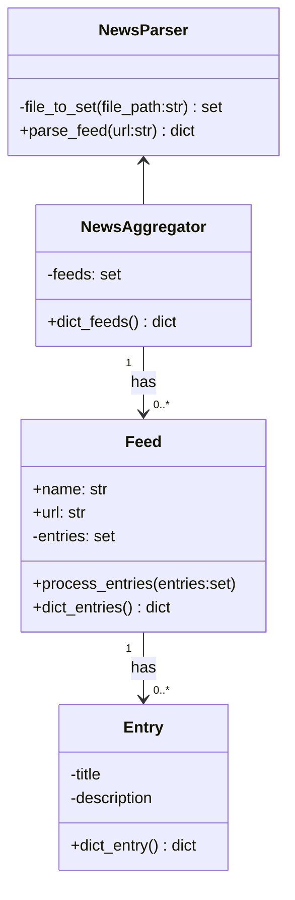

# Development Log

### 01-02-2023

Started working on news aggregator module with the **feedparser** module to aggregate news articles and put them through a sort of sorting algorithm.

> Sorting algorithm calculates weight per feed, after that looks for word occurences and tries to find all *named entities* and sort them to occurance. 

Found out however that the feedparser module does not seem to work with all rss feeds I want to use, therefore planning to use **XML** module instead and write a feedparser of my own. 

Besides that I realised that recognising *named entities* by using **RegEx** and building an algorithm of my own is way too complex to be able to get quality results that I will be start testing with **NLTK** instead.

Also using stopwords by **NLTK** instead of writing them by myself

### 06-02-2023

Starting with high level concept and idea, written in [README.md](/README.md)
Unclear what goal should be, after chat with ChatGPT clearer image. 

Website with geared towards end users being researchers & journalists that aggregates and sorts tweets according to current news events.

> Current news events being provided by a number or well established news sources, both international and regional

>Run script whenever one of the news sources has tweeted a tweet that contains a link to their website? 
Making sure the rss aggregate script does not have to run needlessly
**idea provided by Timothy**

Just read about NLTK VADER, which might be nice to use for twitter content

### 09-02-23

To handle the news parsing module of the application I am thinking of creating a NewsParser class that handles all parsing and returning of parsed news feeds for use in NER. 

In case I'd want to use the newsfeeds in other instances however storing them in objects would also not be a bad idea. 

New dilemma: Does the newsparser call the NER or the other way around. What will the NewsParser be used for: **Only to be run through
 NER**

The only things the Entry() class needs is therefore a title and description/summary as the rest of the information will not be used. 
Possibility to merge title and description but keeping them seperate may yield interesting information in the future.

> Maybe parsing of certain feeds on certain signs is better than to parse them all together changing the classes to be NewsAggregate and spliting the parsing portion as NewsParser
