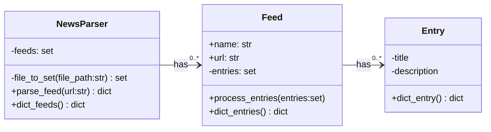
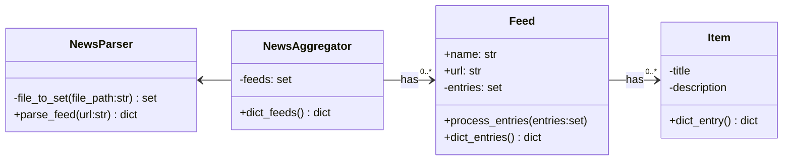
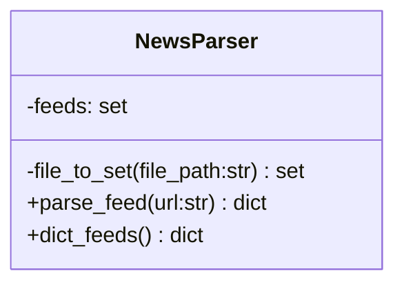

# Development Log

## 01-02-2023

Started working on news aggregator module with the **feedparser** module to aggregate news articles and put them through a sort of sorting algorithm.

> Sorting algorithm calculates weight per feed, after that looks for word occurences and tries to find all *named entities* and sort them to occurance. 

Found out however that the feedparser module does not seem to work with all rss feeds I want to use, therefore planning to use **XML** module instead and write a feedparser of my own. 

Besides that I realised that recognising *named entities* by using **RegEx** and building an algorithm of my own is way too complex to be able to get quality results that I will be start testing with **NLTK** instead.

Also using stopwords by **NLTK** instead of writing them by myself


## 06-02-2023

Starting with high level concept and idea, written in [README.md](/README.md)
Unclear what goal should be, after chat with ChatGPT clearer image. 

Website with geared towards end users being researchers & journalists that aggregates and sorts tweets according to current news events.

> Current news events being provided by a number or well established news sources, both international and regional

>Run script whenever one of the news sources has tweeted a tweet that contains a link to their website? 
Making sure the rss aggregate script does not have to run needlessly
**idea provided by Timothy**

Just read about NLTK VADER, which might be nice to use for twitter content


## 09-02-23

To handle the news parsing module of the application I am thinking of creating a NewsParser class that handles all parsing and returning of parsed news feeds for use in NER. 

In case I'd want to use the newsfeeds in other instances however storing them in objects would also not be a bad idea. 

New dilemma: Does the newsparser call the NER or the other way around. What will the NewsParser be used for: **Only to be run through
 NER**

The only things the Entry() class needs is therefore a title and description/summary as the rest of the information will not be used. 
Possibility to merge title and description but keeping them seperate may yield interesting information in the future.


> Maybe parsing of certain feeds on certain signs is better than to parse them all together changing the classes to be NewsAggregate and spliting the parsing portion as NewsParser




> **Side note for future reference**
> Havent thought about accessibility, might be handy for the front en dpart, maybe too much though...

## 11-02-2023
Started working on NewsParser() and tests, not resally sure whether creating own xml parser is best course of action but we will find out. In a sense it is a very simple parser that only needs to acess certain information, therefore handling it should not be too complex. 
Besides that: Creating a class for the parsing part might be too overkill and a functional programming approach would work better instead of OO.


NewsAggregator() and NewsParser() can once again be combined into one single class which then creates instances of Feed() and Item()



## 12-02-23

Thinking I have maybe already overengineered something, namely the NewsAggregator() module that also contains a Feed class and Item class that I will likely not use and makes everything a bit more complex as it converts a dict into objects but for use by NER it converts these objects back into dicts....
Below what I had, stripping away the Feed and Item class
<details>
<summary>Code snippet with redundant classes</summary>

```
import requests, re, validators
import xml.etree.ElementTree as ET

ERROR_PARSING = 'The parser was unable to succesfully parse the feed or the feed was incomplete'

class Item():
    
    def __init__(self, title, summary):
        self.__title = title
        self.__summary = summary
    
    
    def to_dict(self):
        return {self.__title:self.__summary}
        


class Feed():
    
    def __init__(self, title, language):
        self.__title = title
        self.__language = language
        self.__items = []
    
    
    def add_item(self, item):
        
        self.__items.append(Item(item['title'], item['summary']))
        
    
    def to_dict(self):
        
        feed_dict = dict()
        feed_dict['title'] = self.__title
        feed_dict['language'] = self.__language
        feed_dict['items'] = [item.to_dict() for item in self.__items]
        
        return feed_dict


class NewsAggregator():
    
    def __init__(self):
        self._feeds = set()
    
    def _file_to_set(self, file_path:str):
        """
        Reads file from file_path and returns each line as an element of a set.
        Ignores comments '#' and empty lines

        Args:
            file_path (str): The file to be read

        Returns:
            set: A set with all lines of the read file
        """
        if not isinstance(file_path, str):
            raise TypeError
        
        set_of_file = set()
        
        with open(file_path, 'r') as f:
            lines = f.readlines()
            for line in lines:
                stripped_line = line.strip()
                if stripped_line == '':
                    continue
                elif stripped_line[0] == '#':
                    continue
                set_of_file.add(stripped_line)
        return set_of_file
    
    
    def _parse_feed(self, rss_url:str):
        """
        Parses a rss xml feed. Raises errors whenever the link provided is no .xml file or when the dictionary returned contains an empty title or items. Retrieves feed name, language and title and description from all items. Returns them in a neat dictionary
        
        Will only parse .xml file in rss feed structure as demonstrated here:
        https://www.w3schools.com/XML/xml_rss.asp

        Args:
            rss_url (str): Url or path proided from which to parse an XML document

        Returns:
            dict: Dictionary containing information regarding the feed and its items
        """
        
        xml_feed = rss_url
        if validators.url(rss_url) is True:
            if '.xml' not in rss_url:
                raise Exception('The url provided is not an .xml file')
            
            xml_feed = requests.get(rss_url).content

        tree = ET.parse(xml_feed)
        root = tree.getroot()
        
        feed_dict = dict()
        feed_dict['title'] = root.find('channel/title').text
        feed_dict['lang'] = root.find('channel/language').text
        feed_dict['items'] = []        
        items = root.findall('channel/item')
        
        for item in items:
            title = item.find('title').text.strip()
            summary = "".join(item.find('description').itertext()).strip()
            item_dict = {'title': title, 
                         'summary': summary
                         }
            feed_dict['items'].append(item_dict)
        
        if feed_dict['title'] is None or feed_dict['items'] == []:
            raise Exception(ERROR_PARSING)
        
        return feed_dict
        
       
    def aggregate(self, file_path:str):
        
        if isinstance(file_path, str) is False:
            raise TypeError()

        
        
```

</details>

Now starting with NER module as this will be called by the NewsAggregator() module to run through all feeds.

Still not sure whether I should assig any weights to NE yet.


## 13-02-23

Started reading up more about NLTK. It would do good when creating the NER to make two variants, one being for well organized and gramatically correct text and the other being for tweets for example as the pretrained models are mostly trained on properly written english.

As an alteration of the end product maybe it would do good to show the most talked about topics, (with links to news articles?) with corresponding tweets organized by sentiment (being positive or negative). If training the model is doable ofcourse, however VADER seems to be doing this exact trick, therefore not sure whether to try myself. 
Links for reference:
https://www.guru99.com/pos-tagging-chunking-nltk.html
https://towardsdatascience.com/intro-to-nltk-for-nlp-with-python-87da6670dde
https://realpython.com/python-nltk-sentiment-analysis/

Model for social media posts : VADER
Model for structured content: ?


