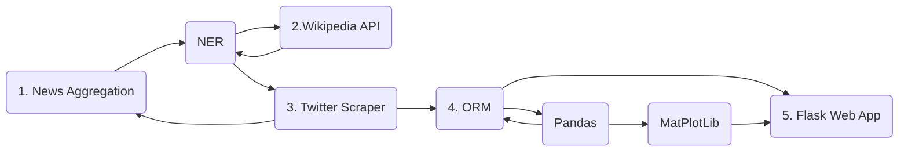
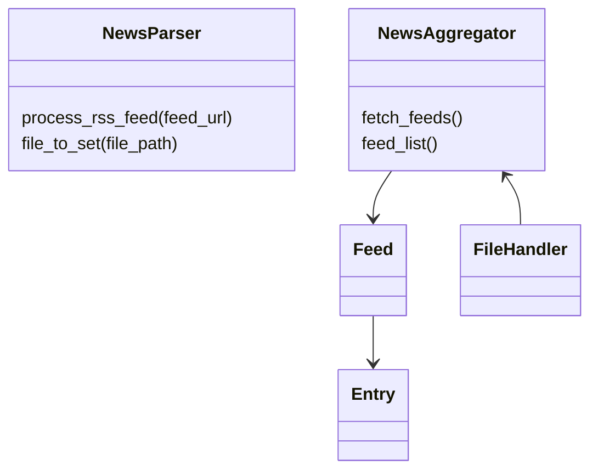

# Real-time Event Tracker

> A web application with the goal of helping anyone interested *(news enthusiasts, journalists, researchers)* to track the development of world events **live** through twitter data. 

## High level concept

Web application that that fetches and shows Twitter posts according to recent news events to provide a real time sort of 'Event Tracker'.

The intended audience for this web application is *journalists & researchers* and anyone that falls between these categories.

You will be able to navigate the website per topic, location etc.

Every tweet is linked to the source to provide an easy way to backtrack context or related information

I will use existing news outlets as a starting point from which to be able to go in depth on subjects that are largely talked about throughout the world in an effort to curb 'noise' generated on Twitter

## Features / Functionalities

1. Searching through the collected tweets by:
    - Date
    - Geo-location
    - Topic
    - Popularity *(formulated by: retweets, likes etc.)*
2. Daily statistics:
	 - Most talked about subjects
	 - Most talked about locations
	 - Amount of tweets per topic compared to previous data points
3.  Possibility to download a batch of tweets and their information as PDF? *(Maybe too much, keep it optional. Would be handy though)*
4. Automatic fetching of new data *(Still not decided how to handle, either via a button with cool-down, tweets posted or on a fixed schedule )*
5. Visual data
	- Using MatPlotLib make some fancy graphs for heads up information regarding different topics
	- Using pandas for the statistical data used by MatPlotLib. Using dataframes as making these calclations manually may take up more CPU/ time / chances or human errors than when relying on the Pandas module
6. Handling of fetching in background to reduce load-time of web page
7. Storing tweets in Postgres DB and loading them through Flask-SQLAlchemy ORM 
8. News Aggregator
	- Planning to build news aggregator with XML library. Tried doing it with the Feedparser module but aggregated way more data than needed and did not work with all RSS feeds therefore I think a self made RSS aggregator would be able to better handle the job and keep computational power to minimum
9. Twitter Scraper
	- Plan to use the SNScrape library for Twitter scraping. Tried using Tweepy but API access is shit without paying therefore this library seems more capable of the job, you don't need API access 
10. Wikipedia Lookup
	- Through the use of the Wikipedia API I hope to broaden the field for which tweets are searched as I hope to run Named Entities recognized in the News Aggregator through the Wikipedia API to get a bigger list of adjacent Named Entities to be queried by the Twitter scraper
11. NLTK
	- Using NLTK to get better information regarding topics, sentiments etc from tweets and news articles
	- VADER
12. Flask Web App
	- Puts everything together to be able to navigate it for end users
13. (optional) Email result page to user email address
	- login form via mail or just email form?
14. (optional) NLP Twitter for sentiment etc...

## Tweet Fetching Algorithm

The first step is to fetch news articles from a variety of *news outlets*[^1] .
Then through Named Entity Recognition you create a set with entities that are run through the Wikipedia API generating multiple text entries. These entries will be analyzed again through Named Entity Recognition which will generate the final set that will be used to query Twitter Tweets regarding the Named Entities in the latest set. 
These can be either handles, hashtags or plain searches. 

[^1]:The choice of news outlets provided is very important as they will determine bias and subjects. At the end of this document a list of 20 international and regional news outlets that could be used are listed.

##  Technologies

#### Front-end

Javascript, HTML & CSS

#### Back-end
Python:

> - NLTK
>	- VADER -> Twitter tweets and News Outlet RSS summaries
>	- Stop words -> instead of writing own take set from NLTK corpus for better results
>	- NER -> Tried checking manually through RegEx, results are very inaccurate, therefore NER from NLTK may offer better results
>
> - Wikipedia API
> - XML 
> - Flask
> - Snscrape(Twitter)
> - Pandas
> - Matplotlib

#### News Outlets[^2]

- The Straits Times (Asia-Pacific)
- The Sydney Morning Herald (Australia/Oceania)
- El País (Latin America)
- Le Monde (Europe)
- Al-Arabiya (Middle East)
- The Guardian Nigeria (Africa)
- La Nación (Latin America)
- South China Morning Post (Asia-Pacific)
- The Moscow Times (Russia and Eastern Europe)
- The Daily Star (South Asia)
- BBC News
- CNN
- Reuters
- Al Jazeera
- The New York Times
- The Guardian
- Deutsche Welle
- China Daily
- France 24
- The Hindu

[^2]: News outlet list generated by ChatGPT, still need to check all sites credentials and whether I'll be able to use a preferably English RSS feeds for NER

## Proces 

##### 07/02/23
Starting with TDD for the news aggregation module. 
Plan to build it as a small lib that can then be extended  if project is expanded

